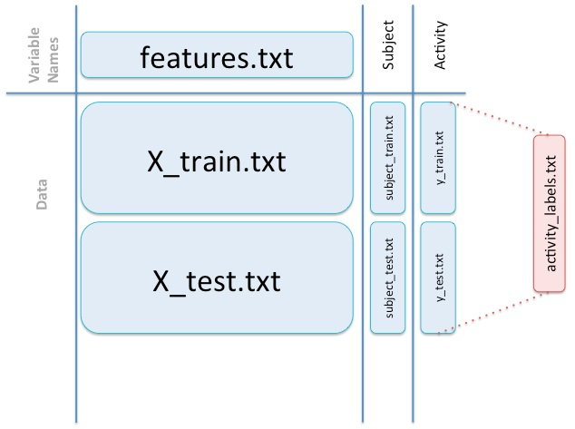

# CodeBook.md#

#### Author: Dale Wickizer ###
#### Date: September 12, 2014 ###

### About the Raw Data Inputs ###

The raw Samsung datasets are in a subdirectory called **UCI HAR Dataset**, which can be found in this directory that contains this file.

The source of this data is from this study:

	Davide Anguita, Alessandro Ghio, Luca Oneto, Xavier Parra and Jorge L. Reyes-Ortiz., Human Activity 
	Recognition on Smartphones using a Multiclass Hardware-Friendly Support Vector Machine. International 
	Workshop of Ambient Assisted Living (IWAAL 2012). Vitoria-Gasteiz, Spain, Dec 2012.

That directory contains the following data files:

**./UCI HAR Database/**

* **./activity\_labels.txt:** A file containing a table of descriptive activity labels and their integer IDs. _The program does NOT use this file._ (See details in next section.)

* **./features\_info.txt:** A file serving as the Code Book for the original data. It describes at a high level how the measurements were taken and values calculated from those measurements.

* **./features.txt:** A file a table of descriptive activity labels and their integer IDs for 561 columns of data. _The program uses this file._

* **./README.txt:** The README file for the original data set, explaining the background of the experiment and providing licensing information for use of the dataset.

**./UCI HAR Database/test/** A directory of test data (30% of the total dataset)

* **./Inertial Signals:** A subdirectory containing the original accelerometer and gyro test data. _This data is NOT used._

* **./subject\_test.txt:** A file containing a numeric vector of the subject IDs, one for each of the 2,947 test observations. _The program uses this file._

* **./X\_test.txt:** A file containing a numeric table of 561 columns with 2,947 test observations (rows). These are the original accelerometer and gyro measures in 3-dimensions, along with numerous derived values (such as mean, standard deviation, energy, frequency, etc.). _The program uses this file._ Each row of the data file contains the observations for these column variables. The values are bounded between -1. and +1.

* **./y\_test.txt:** A file containing a numeric vector of the activity IDs, one for each of the 2,947 test observations. _The program uses this file._

**./UCI HAR Database/train/** A directory of training data (70% of the total dataset)

* **./Inertial Signals:** A subdirectory containing the original accelerometer and gyro training data. _This data is NOT used._

* **./subject\_train.txt:** A file containing a numeric vector of the subject IDs, one for each of the 7,352 training observations. _The program uses this file._

* **./X\_train.txt:** A file containing a numeric table of 561 columns with 7,352 training observations (rows). These are the original accelerometer and gyro measures in 3-dimensions, along with numerous derived values (such as mean, standard deviation, energy, frequency, etc.). _The program uses this file._  As mentioned above, each row of the data file contains the observations for these column variables. The values are bounded between -1. and +1.

* **./y\_train.txt:** A file containing a numeric vector of the activity IDs, one for each of the 7,352 training observations. _The program uses this file._

#### How These Files Relate to One Another ####

Figuring out how all these raw datasets relate to one another is the first challenge. 

* There are test datasets and training datasets making up 30% and 70% of the data.

* Within each, there are Activity IDs (found in the **y\_\*.txt** files) and Subject IDs found in the (**subject\_\*.txt** files), with each row corresponding to a single observation.

* Within each, there are also the actual measurements (in the **./Inertial Signals** subdirectories) and a copy of those measurements along with derived values (in the **X\_\*.txt files**). These were 561 column tables with a single corresponding observation per row. The columns are unlabeled. 

* To translate the Activity IDs to labels, the **./activity\_labels.txt** is used.

* To label the columns from the **X\_\*.txt** files, the **./features.txt:** is used.

**NOTE:** Since we were asked to reduce the number of columns to only those containing mean and standard deviation values, I did not use the files in the **./Inertial Signals** directories.

I found the following diagram from Community TA, David Hood, to be quite helpful in understanding these relationships. (I wish I had seen this before I figured it all out on my own. However, I thought it would be helpful to include for others.)

### The Cooked Data ###

#### Combining Activity and Subject Test and Training Data ####

Combining the Subject data from **./UCI HAR Dataset/test/subject\_test.txt** and **./UCI HAR Dataset/train/subject\_train.txt** and the Activity data from **./UCI HAR Dataset/test/y\_test.txt** and **./UCI HAR Dataset/train/subject\_train.txt** is quite trivial. 

* The order is arbitrary, so I chose to start with the test data and then added the training data. 

* Having read the files into dataframes with *read.table ()*, I combined each of them into their respective dataframes (**Activity** and **Subject**) using *rbind ()*.

#### The Activity Labels ####

Since there were only 6 values, rather than reading in the **activity\_labels.txt** file and figuring out how to apply what was read in, it was simpler to add them in a _switch ()_ statement that gets applied to the data using _lapply ()_. The labels were edited slightly. The actual indexes and labels used within the program were:

		"1" = x <- "WALK", 
		"2" = x <- "UPSTAIRS", 
		"3" = x <- "DOWNSTAIRS",
		"4" = x <- "SIT", 
		"5" = x <- "STAND", 
		"6" = x <- "LAY"

#### Combining Activity and Subject Data ####

It was important to maintain the referential integrity of the data, since each row of Activity label and subject ID data corresponds to the measured values from the **X\_test** and **X\_train data** (to be discussed later).  Therefore, at this stage I combined the Activity and Subject data without sorting. However, I transformed the Subject ID from character to numeric to support proper sorting later on. I then combined these into a temporary data frame using the *dataFrame1 <- data.frame (Activity, Subject)* command.

#### Combining the Unlabeled X\__ Data ####

The unlabeled data from **./UCI HAR Dataset/test/X\_test.txt** and **./UCI HAR Dataset/train/X\_train.txt** was combined in the same manner described above for the Activity and Subject data, using the *rbind ()* command (test data first, then training data). This of course results in a temporary dataframe that is HUGE (10,299 rows x 561 columns).

Before combining the test and trainin data, I chose to first reduce the columns on each to only those columns needed (those containing mean and standard deviation values). The process for reduction is discussed in the **README.md** file.

The data was then combined into another temporary data frame using the *dataFrame2 <- rbind (testData, trainData)* command.

#### Labeling the Unlabeled Data ####

All 561 feature labels and their indexes were read from the **feature.txt** file. Out of the 561 feature labels, the program selects only those for the mean and standard deviation per the instructions. It was decided to use measured and derived data, including the Mean Frequency data, for completeness. (It is always simpler to go back and further reduce the data.) The program uses the _grep ()_ function to search and select the appropriate labels with either "mean" or "std" in the name.  

The resulting labels and indexes were stored in a temporary data frame, called **features**.  

The simplest approach to strip and relabel **dataFrame2** (which contained all the measured adn derived data) was to write it out a temporary file using *write.table (dataFrame2,..., row.names = FALSE, col.names = FALSE)*, then read it back in again using the labels in **features** as column labels:  *dataFrame2 <- read.table(..., col.names = features[,2])*

#### The Feature Labels ####

The following indexes and labels are the ones which were selected, 79 in all:

	  Index      Label					                   Description
	
	    1  tBodyAcc-mean()-X			    Time domain, mean body acceleration, x-axis
	    2  tBodyAcc-mean()-Y			    Time domain, mean body acceleration, y-axis
	    3  tBodyAcc-mean()-Z			    Time domain, mean body acceleration, z-axis
	    4  tBodyAcc-std()-X	    		    Time domain, standard deviation of body accel, x-axis
	    5  tBodyAcc-std()-Y				    Time domain, standard deviation of body accel, y-axis
	    6  tBodyAcc-std()-Z				    Time domain, standard deviation of body accel, z-axis
	   41  tGravityAcc-mean()-X			    Time domain, mean acceleration due to gravity, x-axis
	   42  tGravityAcc-mean()-Y			    Time domain, mean acceleration due to gravity, y-axis
	   43  tGravityAcc-mean()-Z			    Time domain, mean acceleration due to gravity, z-axis
	   44  tGravityAcc-std()-X			    Time domain, std dev of accel due to gravity, x-axis
	   45  tGravityAcc-std()-Y			    Time domain, ssd dev of accel due to gravity, y-axis
	   46  tGravityAcc-std()-Z			    Time domain, std dev of accel due to gravity, z-axis
	   81  tBodyAccJerk-mean()-X		    Time domain, mean jerk (derivative of accel), x-axis
	   82  tBodyAccJerk-mean()-Y		    Time domain, mean jerk (derivative of accel), y-axis
	   83  tBodyAccJerk-mean()-Z		    Time domain, mean jerk (derivative of accel), y-axis
	   84  tBodyAccJerk-std()-X			    Time domain, standard deviation of jerk, x-axis
	   85  tBodyAccJerk-std()-Y			    Time domain, standard deviation of jerk, y-axis
	   86  tBodyAccJerk-std()-Z			    Time domain, standard deviation of jerk, z-axis
	  121  tBodyGyro-mean()-X			    Time domain, mean angular motion, x-axis
	  122  tBodyGyro-mean()-Y			    Time domain, mean angular motion, y-axis
	  123  tBodyGyro-mean()-Z			    Time domain, mean angular motion, z-axis
	  124  tBodyGyro-std()-X			    Time domain, std dev of angular motion, x-axis
	  125  tBodyGyro-std()-Y			    Time domain, std dev of angular motion, y-axis
	  126  tBodyGyro-std()-Z			    Time domain, std dev of angular motion, z-axis
	  161  tBodyGyroJerk-mean()-X		    Time domain, mean angular jerk, x-axis
	  162  tBodyGyroJerk-mean()-Y		    Time domain, mean angular jerk, y-axis
	  163  tBodyGyroJerk-mean()-Z		    Time domain, mean angular jerk, z-axis
	  164  tBodyGyroJerk-std()-X		    Time domain, std dev of angular jerk, x-axis
	  165  tBodyGyroJerk-std()-Y		    Time domain, std dev of angular jerk, y-axis
	  166  tBodyGyroJerk-std()-Z		    Time domain, std dev of angular jerk, z-axis
	  201  tBodyAccMag-mean()			    Time domain, mean magnitude of accel vector
	  202  tBodyAccMag-std()			    Time domain, std dev of mag of accel vector
	  214  tGravityAccMag-mean()		    Time domain, mean magnitude of gravity vector
	  215  tGravityAccMag-std()			    Time domain, std dev of mag of gravity vector
	  227  tBodyAccJerkMag-mean()		    Time domain, mean magnitude of jerk vector
	  228  tBodyAccJerkMag-std()		    Time domain, std dev of mag of jerk vector
	  240  tBodyGyroMag-mean()			    Time domain, mean mag of angular motion vector
	  241  tBodyGyroMag-std()			    Time domain, std dev of mag of angular motion vector
	  253  tBodyGyroJerkMag-mean()		    Time domain, mean magnitude of angular jerk vector
	  254  tBodyGyroJerkMag-std()		    Time domain, std dev of mag of angular jerk vector
	  266  fBodyAcc-mean()-X				Frequency domain, mean body acceleration, x-axis
	  267  fBodyAcc-mean()-Y				Frequency domain, mean body acceleration, y-axis
	  268  fBodyAcc-mean()-Z				Frequency domain, mean body acceleration, z-axis
	  269  fBodyAcc-std()-X    				Freq domain, standard deviation of body accel, x-axis
	  270  fBodyAcc-std()-Y    				Freq domain, standard deviation of body accel, y-axis
	  271  fBodyAcc-std()-Z    				Freq domain, standard deviation of body accel, z-axis
	  294  fBodyAcc-meanFreq()-X			Freq domain, weighted mean of body accel, x-axis
	  295  fBodyAcc-meanFreq()-Y			Freq domain, weighted mean of body accel, y-axis
	  296  fBodyAcc-meanFreq()-Z			Freq domain, weighted mean of body accel, z-axis
	  345  fBodyAccJerk-mean()-X			Freq domain, mean jerk (derivative of accel), x-axis
	  346  fBodyAccJerk-mean()-Y			Freq domain, mean jerk (derivative of accel), y-axis
	  347  fBodyAccJerk-mean()-Z			Freq domain, mean jerk (derivative of accel), z-axis
	  348  fBodyAccJerk-std()-X				Freq domain, std dev of jerk, x-axis
	  349  fBodyAccJerk-std()-Y				Freq domain, std dev of jerk, y-axis
	  350  fBodyAccJerk-std()-Z				Freq domain, std dev of jerk, z-axis
	  373  fBodyAccJerk-meanFreq()-X		Freq domain, weighted mean of body jerk, x-axis
	  374  fBodyAccJerk-meanFreq()-Y		Freq domain, weighted mean of body jerk, y-axis
	  375  fBodyAccJerk-meanFreq()-Z		Freq domain, weighted mean of body jerk, z-axis
	  424  fBodyGyro-mean()-X				Freq domain, mean angular motion, x-axis
	  425  fBodyGyro-mean()-Y				Freq domain, mean angular motion, y-axis
	  426  fBodyGyro-mean()-Z				Freq domain, mean angular motion, z-axis
	  427  fBodyGyro-std()-X				Freq domain, std dev of angular motion, x-axis
	  428  fBodyGyro-std()-Y				Freq domain, std dev of angular motion, y-axis
	  429  fBodyGyro-std()-Z				Freq domain, std dev of angular motion, z-axis
	  452  fBodyGyro-meanFreq()-X			Freq domain, weighted mean of angular jerk, x-axis
	  453  fBodyGyro-meanFreq()-Y			Freq domain, weighted mean of angular jerk, y-axis
	  454  fBodyGyro-meanFreq()-Z			Freq domain, weighted mean of angular jerk, z-axis
	  503  fBodyAccMag-mean()				Freq domain, mean magnitude of accel vector
	  504  fBodyAccMag-std()				Freq domain, std dev of mag of accel vector
	  513  fBodyAccMag-meanFreq()			Freq domain, weighted mean of mag of accel vector
	  516  fBodyBodyAccJerkMag-mean()		Freq domain, mean magnitude of jerk vector
	  517  fBodyBodyAccJerkMag-std()		Freq domain, std dev of mag of jerk vector
	  526  fBodyBodyAccJerkMag-meanFreq()	Freq domain, weighted mean of mag of jerk vector
	  529  fBodyBodyGyroMag-mean()			Freq domain, mean mag of angular motion vector
	  530  fBodyBodyGyroMag-std()			Freq domain, std dev of mag of ang motion vector
	  539  fBodyBodyGyroMag-meanFreq()		Freq domain, weighted mean of mag of ang vector
	  542  fBodyBodyGyroJerkMag-mean()		Freq domain, mean mag of angular jerk vector
	  543  fBodyBodyGyroJerkMag-std()		Freq domain, std dev of mag of ang jerk vector
	  552  fBodyBodyGyroJerkMag-meanFreq()	Freq domain, weighted mean of ang jerk vector

#### Calculating the Mean Values by Activity and Subject ####

The final process entailed combining the Activity and Subject data in **dataFrame1** with the newly relabeled data from **dataFrame2** and sorting that by Activity and subject. The resulting data table was called **allData**.

The means of all the columns were then calculated by Activity and Subject from **allData**. That process is described in the README.md file.

The result was a data table called tidyData, which is either written to a file (default) or returned.

### Other Generated Files ###

* **Tidy\_Raw\_Samsung_Data.txt:** This file is generated when the runtime parameter of **lean = FALSE** is used. It is a dump of the **allData** data table, a tidy data set of the Samsung data before the final mean values are calculated.

* **Excel Truth.xlsx:** This is a file where I imported the **Tidy\_Raw\_Samsung_Data.txt:** file and created a pivot table to use as a model. It helped me get my mind around what I should expect to see as the final result from Step 5 of the problem.

* **Tidy\_Samsung\_Data\_Averages\_by\_Activity\_and\_Subject:** This is final file generated by default by the program, where the means values of all column vectors are calculated for every activity and every subject. It is the output of the **tidyData** data table.

* **tidyOut Results.xlsx:** This is merely and Excel import of the final results from the above file to compare with the **Excel Truth.xlsx** model.
